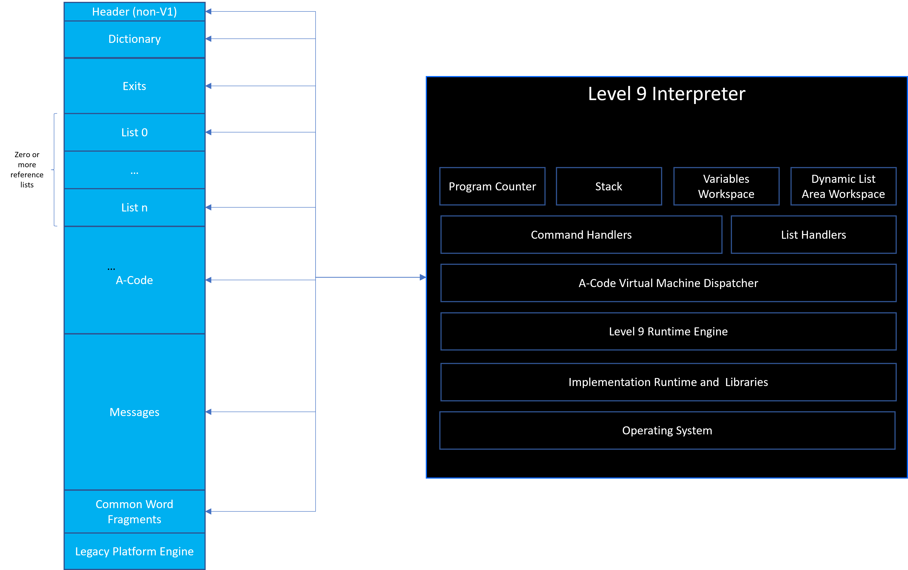
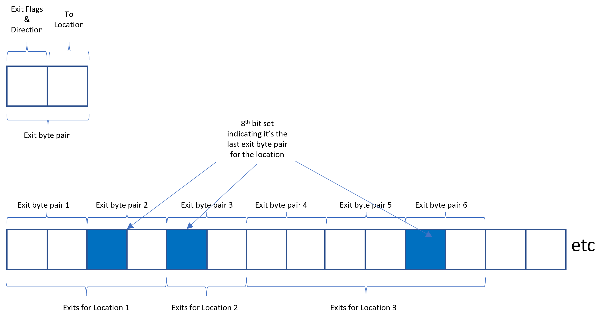

# Level 9 A-Code (Version 1) Specification

---
---

## Convention

This document uses the same function and list handler names as the [Level 9 interpeter by Glenn Summers and others](https://github.com/DavidKinder/Level9/blob/master/level9.c) for consistency and familiarity.  This was used a reference to functions only as I struggled understanding the code - nearly all my understanding came from decompiling the BBC Micro's game code.

---

---

## Acknowledgements

Many thanks to [Neil Hunter](https://github.com/neildhunter) for his diligent review of this specification, correcting many typos and cut and paste issues.

---

---

## *A-Code*

---

### *Overview*

In order to play a game, an engine or virtual machine needs to be written. The components required within the architecture of the engine on any platform and any implementation language are shown below:



On the left hand side, a typical Level 9 adventure game file is shown with its constituent parts:

- **Header** - All versions of Level 9 adventure games have headers however for Version 1 they are embedded in the Legacy Platform Engine and not straightforward to find (and will vary across platform).  Typically interpreters will look for a byte code signature at the start of the A-Code to identify the game and then use "hard coded" offsets to find the rest of the components. For Version 2+ these are all identified in the header
- **A-Code** - the instructions to execute in the virtual machine to run the adventure game.  This is the language that Level 9 used to code the logic of the game, turned into byte code, in a similar way that modern languages like Java or C# "compile" to byte code.
- **Messages** - the adventure game's text e.g. room descriptions, object descriptions, responses to player commands.  Messages are referenced by the A-Code either as a constant message id or via a variable value.
- **Dictionary** - a compressed and encoded list of commands and objects that the adventure game understands
- **Common Word Fragments** - an extracted list of commonly occuring common word fragments from the dictionary and messages above.  This can themselves contain common word fragment references.
- **Lists** - there are two kinds - reference and dynamic lists. Reference information could be an object's initial location and a dynamic list could be an object's current location.
- **Exits** - Each location has at least one exit (direction a player can move in).  There is a table which defines them for all locations.  Some of the exits can be used for inverse movement lookup (if there's no exit moving W from location 1, is there an exit moving E to location 1 from another location and does the flag allow this).
- **Jump tables** - a bit like a list of function references, a table of absolute locations in the A-Code where to "jump" to. Version 1 games have a maximum of one and only seen in Colossal Adventure and Adventure Quest.


The right hand side details the engine with the following components:

- **Program Counter** - where in the A-Code the current operator or parameters or jump table entries are. This is used to follow the A-Code and execute the adventure.
- **Stack** - used to track "gosub" commands in the A-Code and where to return to in the A-Code when the gosub completes and issues a return.  The return address in the A-Code is stored here in a First In Last Out pattern (FILO)
- **Variables Workspace** - variables are used by the A-Code to store runtime information e.g. state of an object or number of turns before something happens.  These sit alongside dynamic lists which are typically holding information about a game object or non-player character
- **Dynamic List Area Workspace** - used to store data for the dynamic lists
- **Command Handlers** - heart of the runtime engine for processing the A-Code.  Takes the operators and performs commands based on their value and parameters 
- **List Handlers** - perform manipulations on lists either setting list items from variables, or setting variables from list items
- **Level 9 Runtime Engine** - sets up the engine, allocates memory as required, loads the game file, finds the component parts, sets up the main loop that reads the A-Code and despatches to the appropriate command and list handlers.
- **Implementation Runtime and Libraries** - if e.g. python and requires an interpreter, or even just 8-Bit Machine operating system libraries for the Level 9 Runtime Engine.  Also, most langauges support libraries for ease and acceleration of implementation, for example, i/o libraries for reading files.
- **Operating System** - the target operating system(s), one or more, and the services it provides the above stack

--- 

### *General A-Code Syntax*

- All A-Code opcodes are in the following format where &lt;operator&gt; and &lt;operand&gt; are a single byte (8bits):
```
    <operator> [<operand1>] [<operand2>] [<operand3>] [<operand4>]
```
- An A-Code operator can be either a Command or a List Handler function
    - List handler functions have bit-8 set to 1
    - Command Handlers have bit-8 set to 0
    - There is room in the operators for and engine for up to 30 different commands however for the BBC Micro Version 1 only 22 are implemented
    - Only four List Handler functions are supported
- An A-Code operand can be:
    - A variable number
    - A constant
    - The LSB or MSB of the constant value
    - A (signed) offset
    - The LSB or MSB of an unsigned offset

---

---

## *Level 9 Runtime Engine*

---

The Level 9 Runtime Engine is responsible for the following aspects:

- Loading the game file
- Using the header information to identify where the different parts of the game are e.g. the dictionary, the A-code and so on
- Making available a "stack" to store and remove Gosub return addresses (each address is 16-bits)
- Providing variable wokrspace storage (each variable is 16-bits) and indexing by variable number
- Performing dynamic list area workspace storage and indexing (each item is 8-bits)
- Implementing Command Handlers for each of the supported commands
- Defining List Handlers for all four required maniupulations
- Managing a program counter that:
    - Starts at the beginning of the A-Code
    - Reads the next opcode and identifies the operator
    - Dispatches the opcode to the appropriate command handler or list handler
    - Allows the program counter to be updated by commands e.g. gosub/goto
    - Provides functions to read and interpret any operands
    - Reads the next opcode and loops around to process it
- Interfacing with the operating system e.g. screen and file handling

---

---

## *Command Handlers*

---

Command handlers are the main processing engine of the interpreter / virtual machine. Once the A-Code has been read and an operator identified, if it matches a command then the command will perform one of many functions to fulfil that command.. 

---

### *Supported Commands*

The following table defines the list of commands (note that the # column is the operator's bits 5-1):

|Dec|Hex|Name|Comment|
|:---:|:---:|---|---|
|0|0x00|[goto](#goto)|Performs a relative or absolute goto|
|1|0x01|[intgosub](#intgosub)|Performs a relative or absolute gosub|
|2|0x02|[intreturn](#intreturn)|Returns from a gosub|
|3|0x03|[printnumber](#printnumber)|Prints a double byte / 16-bit variable value|
|4|0x04|[messagev](#messagev)|Prints the nth message based on the id held in variable|
|5|0x05|[messagec](#messagec)|Prints the nth message based on the id held in single or double byte constant|
|6|0x06|[function](#function)|Perform one of 5 functions (see later)  |
|7|0x07|[input](#input)|Get, parse the player's input|
|8|0x08|[varcon](#varcon)|Set the variable value to an 8-bit or 16-bit constant|
|9|0x09|[varvar](#varvar)|Set variable1's value to the value of variable2|
|10|0x0A|[_add](#_add)|Set variable1 = variable2 + variable1|
|11|0x0B|[_sub](#_sub)|Set variable2 = variable2 - variable1|
|12|0x0C|ilins|Illegal instruction - forces a break on a BBC Micro|
|13|0x0D|ilins|Illegal instruction - forces a break on a BBC Micro|
|14|0x0E|[jump](#jump)|Jump to A-code address in specified lookup table|
|15|0x0F|[exit](#exit)|Can user go in direction x from location y?|
|16|0x10|[ifeqvt](#ifeqvt)|if variable1 == variable2 then goto offset/absolute|
|17|0x11|[ifnevt](#ifnevt)|if variable1 != variable2 then goto offset/absolute|
|18|0x12|[ifltvt](#ifltvt)|if variable1 < variable2 then goto offset/absolute|
|19|0x13|[ifgtvt](#ifgtvt)|if variable1 > variable2 then goto offset/absolute|
|20|0x14|ilins|Illegal instruction - forces a break on a BBC Micro|
|21|0x15|ilins|Illegal instruction - forces a break on a BBC Micro|
|22|0x16|ilins|Illegal instruction - forces a break on a BBC Micro|
|23|0x17|ilins|Illegal instruction - forces a break on a BBC Micro|
|24|0x18|[ifeqct](#ifeqct)|if variable == constant then goto offset/absolute|
|25|0x19|[ifnect](#ifnect)|if variable != constant then goto offset/absolute|
|26|0x1A|[ifltct](#ifltct)|if variable < constant then goto offset/absolute|
|27|0x1B|[ifgtct](#ifgtct)|if variable > constant then goto offset/absolute|
|28|0x1C|ilins|Illegal instruction - forces a break on a BBC Micro|
|29|0x1D|ilins|Illegal instruction - forces a break on a BBC Micro|
|30|0x1E|ilins|Illegal instruction - forces a break on a BBC Micro|
|31|0x1F|ilins|Illegal instruction - forces a break on a BBC Micro|

---

### *Format*

When an A-code operator represents a Command function, depending on the function, it will be in the following format (can have 0,1,2,3 or 4 operands):

```
    <operator> [<operand1>] [<operand2>] [<operand3>] [<operand4>] [<operand5>]
```

Each &lt;operand&gt; will have a different meaning depending on the command and its context.
    
Specifically, depending on the command, and Bits 7-6, one of the following patterns will be matched. The anatomy of a command is therefore:
- Bit 8 - Always set to 0 for a command
- Bit 7
    - If set to 1, a single byte (8-bit) constant in the operands
    - If set to 0, a double byte (16-bit) constant in the operands
- Bit 6
    - If set to 1, a single byte (8-bit) goto offset in the operands
    - If set to 0, a double byte (16-bit) goto offset in the operands
- Bits 5-1 - the actual operator opcode for the command 

Note that not all commands use either both or one of Bits 7-6. It is possible to generate A-Code that does but it would be ignored by the engine. And this has not been seen in BBC Micro Version 1 A-Code and therefore those combinations have not been documented here.

The full list of commands, the operator opcodes and potential operands:

| Command                     | OpCode         | OpCode | Bits 5-1  | Format and Operand Meaning|
| :---:                       | :---:          | :---:  | :---:     | :--- |
| [goto](#goto)               | 0000&nbsp;0000 | 0x00   |     0x00  | &lt;operator&gt; &lt;offset lsb&gt; &lt;offset msb&gt;      |
|                             | 0010&nbsp;0000 | 0x20   |     0x00  | &lt;operator&gt; &lt;offset&gt;                             |   
| [intgosub](#gosub)          | 0000&nbsp;0001 | 0x01   |     0x01  | &lt;operator&gt; &lt;offset lsb&gt; &lt;offset msb&gt;      |  
|                             | 0010&nbsp;0001 | 0x21   |     0x01  | &lt;operator&gt; &lt;offset&gt;                             |
| [intreturn](#intreturn)     | 0010&nbsp;0010 | 0x02   |     0x02  | &lt;operator&gt;                                            |
| [printnumber](#printnumber) | 0000&nbsp;0011 | 0x03   |     0x03  | &lt;operator&gt; &lt;variable&gt;                           |
| [messagev](#messagev)       | 0000&nbsp;0100 | 0x04   |     0x04  | &lt;operator&gt; &lt;variable&gt;                           |
| [messagec](#messagec)       | 0000&nbsp;0101 | 0x05   |     0x05  | &lt;operator&gt; &lt;constant lsb&gt; &lt;constant msb&gt;  |
|                             | 0100&nbsp;0101 | 0x45   |     0x05  | &lt;operator&gt; &lt;constant&gt;                           |
| [function](#function)       | 0000&nbsp;0110 | 0x06   |     0x06  | &lt;operator&gt; &lt;constant&gt;                           |
| [input](#input)             | 0000&nbsp;0111 | 0x07   |     0x07  | &lt;operator&gt; &lt;variable1&gt; &lt;variable2&gt; &lt;variable3&gt; &lt;variable4&gt; |
| [varcon](#varcon)           | 0000&nbsp;1000 | 0x08   |     0x08  | &lt;operator&gt; &lt;constant lsb&gt; &lt;constant msb&gt; &lt;variable&gt; |
|                             | 0100&nbsp;1000 | 0x48   |     0x08  | &lt;operator&gt; &lt;constant&gt; &lt;variable&gt; |
| [varvar](#varvar)           | 0000&nbsp;1001 | 0x09   |     0x09  | &lt;operator&gt; &lt;variable1&gt; &lt;variable2&gt; |
| [_add](#_add)               | 0000&nbsp;1010 | 0x0A   |     0x0A  | &lt;operator&gt; &lt;variable1&gt; &lt;variable2&gt; |
| [_sub](#_sub)               | 0000&nbsp;1011 | 0x0B   |     0x0B  | &lt;operator&gt; &lt;variable1&gt; &lt;variable2&gt; |
| [jump](#jump)               | 0000&nbsp;1110 | 0x0E   |     0x0E  | &lt;operator&gt; &lt;constant lsb&gt; &lt;constant msb&gt; &lt;variable&gt; |
| [exit](#exit)               | 0000&nbsp;1111 | 0x0F   |     0x0F  | &lt;operator&gt; &lt;variable1&gt; &lt;variable2&gt; &lt;variable3&gt; &lt;variable4&gt; |
| [ifeqvt](#ifeqvt)           | 0001&nbsp;0000 | 0x10   |     0x10  | &lt;operator&gt; &lt;variable1&gt; &lt;variable2&gt; &lt;offset lsb&gt; &lt;offset msb&gt; |   
|             | 0011&nbsp;0000 | 0x30   |     0x10  | &lt;operator&gt; &lt;variable1&gt; &lt;variable2&gt; &lt;offset&gt; |
| [ifnevt](#ifnevt)           | 0001&nbsp;0001 | 0x11   |     0x11  | &lt;operator&gt; &lt;variable1&gt; &lt;variable2&gt; &lt;offset lsb&gt; &lt;offset msb&gt; |  
|             | 0011&nbsp;0001 | 0x31   |     0x11  | &lt;operator&gt; &lt;variable1&gt; &lt;variable2&gt; &lt;offset&gt; |    
| [ifltvt](#ifltvt)           | 0001&nbsp;0010 | 0x12   |     0x12  | &lt;operator&gt; &lt;variable1&gt; &lt;variable2&gt; &lt;offset lsb&gt; &lt;offset msb&gt; |
|             | 0011&nbsp;0010 | 0x32   |     0x12  | &lt;operator&gt; &lt;variable1&gt; &lt;variable2&gt; &lt;offset&gt; |    
| [ifgtvt](#ifgtvt)           | 0001&nbsp;0011 | 0x13   |     0x13  | &lt;operator&gt; &lt;variable1&gt; &lt;variable2&gt; &lt;offset lsb&gt; &lt;offset msb&gt; |  
|             | 0011&nbsp;0011 | 0x33   |     0x13  | &lt;operator&gt; &lt;variable1&gt; &lt;variable2&gt; &lt;offset&gt; |    
| [ifeqct](#ifeqct)           | 0001&nbsp;1000 | 0x18   |     0x18  |  &lt;operator&gt; &lt;variable1&gt; &lt;constant lsb&gt; &lt;constant msb&gt;  &lt;offset lsb&gt;  &lt;offset msb&gt;|
|             | 0011&nbsp;1000 | 0x38   |     0x18  |  &lt;operator&gt; &lt;variable1&gt; &lt;constant lsb&gt; &lt;constant msb&gt; &lt;offset&gt; |
|             | 0101&nbsp;1000 | 0x58   |     0x18  |  &lt;operator&gt; &lt;variable1&gt; &lt;constant&gt; &lt;offset lsb&gt;  &lt;offset msb&gt;|
|             | 0111&nbsp;1000 | 0x78   |     0x18  |  &lt;operator&gt; &lt;variable1&gt; &lt;constant&gt; &lt;offset&gt;|
| [ifnect](#ifnect)            | 0001&nbsp;1001 | 0x19   |     0x19  |  &lt;operator&gt; &lt;variable1&gt; &lt;constant lsb&gt; &lt;constant msb&gt; &lt;offset lsb&gt;  &lt;offset msb&gt;|
|             | 0011&nbsp;1001 | 0x39   |     0x19  |  &lt;operator&gt; &lt;variable1&gt; &lt;constant lsb&gt; &lt;constant msb&gt; &lt;offset&gt; |
|             | 0101&nbsp;1001 | 0x59   |     0x19  |  &lt;operator&gt; &lt;variable1&gt; &lt;constant&gt; &lt;offset lsb&gt;  &lt;offset msb&gt;|
|             | 0111&nbsp;1001 | 0x79   |     0x19  |  &lt;operator&gt; &lt;variable1&gt; &lt;constant&gt; &lt;offset&gt;|
| [ifltct](#ifltct)            | 0001&nbsp;1010 | 0x1A   |     0x1A  |  &lt;operator&gt; &lt;variable1&gt; &lt;constant lsb&gt; &lt;constant msb&gt; &lt;offset lsb&gt;  &lt;offset msb&gt;|
|             | 0011&nbsp;1010 | 0x3A   |     0x1A  |  &lt;operator&gt; &lt;variable1&gt; &lt;constant lsb&gt; &lt;constant msb&gt; &lt;offset&gt; |
|             | 0101&nbsp;1010 | 0x5A   |     0x1A  |  &lt;operator&gt; &lt;variable1&gt; &lt;constant&gt; &lt;offset lsb&gt;  &lt;offset msb&gt;|
|             | 0111&nbsp;1010 | 0x7A   |     0x1A  |  &lt;operator&gt; &lt;variable1&gt; &lt;constant&gt; &lt;offset&gt;|
| [ifgtct](#ifgtct)            | 0001&nbsp;1011 | 0x1B   |     0x1B  |  &lt;operator&gt; &lt;variable1&gt; &lt;constant lsb&gt; &lt;constant msb&gt; &lt;offset lsb&gt;  &lt;offset msb&gt;|
|             | 0011&nbsp;1011 | 0x3B   |     0x1B  |  &lt;operator&gt; &lt;variable1&gt; &lt;constant lsb&gt; &lt;constant msb&gt; &lt;offset&gt; |
|             | 0101&nbsp;1011 | 0x5B   |     0x1B  |  &lt;operator&gt; &lt;variable1&gt; &lt;constant&gt; &lt;offset lsb&gt;  &lt;offset msb&gt;|
|             | 0111&nbsp;1011 | 0x7B   |     0x1B  |  &lt;operator&gt; &lt;variable1&gt; &lt;constant&gt; &lt;offset&gt;|

For manual decoding, this table is also sorted by Operator OpCode values in [Appendix A](#appendix)

The next sections define in detail the responsibility of each command handler.

---


### *<a href="#goto">goto</a>* 

---

Performs a goto based on the operands that follow (two similar functions):

1. If Bit 6 set -  only one operand (8-bit offset) and performs a relative +/- goto (+128 to -127). So the relative offset is a single byte / 8-bit **signed** offset used to go back or forward from the current A-Code program counter

    > A-Code address = pc + signed single byte offset

2. If Bit 6 is not set - two operands (16-bit offset) and performs an absolute goto from the start of the A-Code. So the absolute offset is a double byte / 16-bit **unsigned** offset used to find an absolute A-Code address relative to the start of the A-Code.

    > A-Code address = A-Code start + offset msb * 256 + offset lsb

Possible operator values (in hexadecimal and binary):

| Hex   | Binary    | A-Code Syntax | 
| :---: | :---:     | ---           | 
| 00    | 0000 0000 | &lt;operator&gt; &lt;offset lsb&gt; &lt;offset msb&gt; | 
| 20    | 0010 0000 | &lt;operator&gt; &lt;offset&gt; | 

Notes:

- Technically possible to have Bit 7 set but will be ignored by the engine and not seen in any BBC Level 9 Version 1 game, hence those variants have not been documented here as valid opcodes.

---

### *<a href="#intgosub">intgosub</a>*

---

Performs a gosub based on the operands that follow (two similar functions):

1. Adds the current program counter to the stack (so it can be returned to later)

2. If Bit 6 set -  only one operand (8-bit offset) and performs a relative +/- gosub (+128 to -127). So the relative offset is a single byte / 8-bit **signed** offset used to go back or forward from the current A-Code program counter

    > A-Code address = pc + signed single byte offset

3. If Bit 6 is not set - two operands (16-bit offset) and performs an absolute gosub from the start of the A-Code. So the absolute offset is a double byte / 16-bit **unsigned** offset used to find an absolute A-Code address relative to the start of the A-Code.

    > A-Code address = A-Code start + offset msb * 256 + offset lsb

4. Calls goto to perform the branch

Possible operator values (in hexadecimal and binary):

| Hex   | Binary    | A-Code Syntax | 
| :---: | :---:     | ---           | 
| 01    | 0000 0001 | &lt;operator&gt; &lt;offset lsb&gt; &lt;offset msb&gt; | 
| 21    | 0010 0001 | &lt;operator&gt; &lt;offset&gt; | 

Notes:

- Technically possible to have Bit 7 set but should be ignored by the engine and not seen in any BBC Level 9 Version 1 game, hence those variants have not been documented here as valid opcodes.

---

### *<a href="#intreturn">intreturn</a>*

---

Performs a return from a previous gosub (opposite of intgosub) by pulling the return address from the virtual machine's stack:

1. Pull last pushed return address from stack
2. Point program counter at return address

Possible operator values (in hexadecimal and binary):

| Hex   | Binary    | A-Code Syntax | 
| :---: | :---:     | ---           | 
| 02    | 0000 0010 | &lt;operator&gt; | 

Notes:

- Technically possible to have Bit 7 set and / or Bit 6 but should be ignored by the engine and not seen in any BBC Level 9 Version 1 game, hence those variants have not been documented here as valid opcodes.

---

### *<a href="#printnumber">printnumber</a>*

---

Performs a print of a number to the screen. 

1. It has a single operand - the operand indicates which variable holds the value of the number to print
2. Numbers can be 16-bit (as all variables hold 16-bit values)
3. Numbers are *unsigned*
4. Numbers can be from 0 to 65535
5. Just prints in the next row position on the screen using normal formatting rules (please reference)

Possible operator values (in hexadecimal and binary):

| Hex   | Binary    | A-Code Syntax | 
| :---: | :---:     | ---           | 
| 03    | 0000 0011 | &lt;operator&gt; &lt;variable&gt; | 


Notes:

- Could be formatted with commas but the BBC Micro engine just prints the digits and assumes it is an integer.
- Technically possible to have Bit 7 and / or Bit 6 set but should be ignored by the engine and not seen in any BBC Level 9 Version 1 game, hence those variants have not been documented here as valid opcodes.

---

### *<a href="#messagev">messagev</a>*

---

Performs a print of a message to the screen. The single operand contains the variable number that contains the message id to print.

1. It has a single operand - the operand indicates which variable holds the value of the message to print
2. Up to 65535 messages could be addressed given each variable holds a 16-bit / 2 byte value
3. Finds the message by looping through the messages
    - If message 0 it's the start of the messages until $01 (message terminator)
    - If it's message n, the loop through until n $01s have been found
    - If $00 is found at any point, error as it's the end of the messages list
5. Just prints in the next row position on the screen using normal formatting rules (please reference)

Possible operator values (in hexadecimal and binary):

| Hex   | Binary    | A-Code Syntax | 
| :---: | :---:     | ---           | 
| 04    | 0000 0100 | &lt;operator&gt; &lt;variable&gt; | 

Notes:

- Technically possible to have Bit 7 and / or Bit 6 set but should be ignored by the engine and not seen in any BBC Level 9 Version 1 game, hence those variants have not been documented here as valid opcodes.

---

### *<a href="#messagec">messagec</a>*

---

Performs a print of a message to the screen. The single operand contains the variable number that contains the message id to print.

1. It has one or two operands - the operand(s) indicate which variable holds the value of the message to print
2. Bit 7 indicates if there are one or two constant operands:
    - If set, there is only one operand to give an 8-bit message number
    - If unset, there are two operands to give a 16-bit message number
2. Up to 65535 messages can therefore be addressed given 
3. Finds the message by looping through the messages
    - If message 0 it's the start of the messages until $01 (message terminator)
    - If it's message n, the loop through until n $01s have been found
    - If $00 is found at any point, error as it's the end of the messages list
5. Just prints in the next row position on the screen using normal formatting rules (please reference)

Possible operator values (in hexadecimal and binary):

| Hex   | Binary    | A-Code Syntax | 
| :---: | :---:     | ---           | 
| 05    | 0000 0101 | &lt;operator&gt; &lt;constant lsb&gt; &lt;constant msb&gt; | 
| 45    | 0100 0101 | &lt;operator&gt; &lt;constant&gt;| 

Notes:

- Technically possible to have Bit 6 set but should be ignored by the engine and not seen in any BBC Level 9 Version 1 game, hence those variants have not been documented here as valid opcodes.

---

### *<a href="#function">function</a>*

---

Performs one of a number of system utility functions. It has a single constant operand that indicates which function is required:

- 0x01 - Exit gracefully (all games use this on 'no' to 'Another game?')
- 0x02 - Generate new random seed
    1. The oldSeed should be zero before loading the game
    2. To be authenticate the following algorithm should be used (Javascript / Python-esque):

        > ((((((oldSeed << 8) + 0x0A) - oldSeed) <<>  2) + oldSeed) + 1) & 0xFFFF
    3. Set the variable value to the lowest 8-bits of this value
- 0x03 - Save current game
    - Save all the variable 16-bit values to a file or similar persistent storage
    - Save the 8-bit values of the any dynamic lists to a file or similar persistent storage
- 0x04 - Load (restore) saved game
    - Load all the 8-bit values of the any dynamic lists from a file or similar persistent storage into memory over the existing dynamic lists
    - Load all the variable 16-bit values from a file or similar persistent storage over the existing dynamic lists
- 0x05 - Clear variables
    - Set all of the 16-bit variables to have a value of 0x0000
- 0x06 - Clear stack     
    - Remove any game information pushed there i.e. gosub return addresses.
    - The BBC Micro engine resets the stack pointer to either $01E0 or $0180 (!)


| Hex   | Binary    | A-Code Syntax | 
| :---: | :---:     | ---           | 
| 06    | 0000 0110 | &lt;operator&gt; &lt;constant&gt; [ &lt;variable&gt; ]| 

Notes:

- [ &lt;variable&gt; ] only used by the generate new random seed function
- Technically possible to have Bit 7 and / or Bit 6 set but should be ignored by the engine and not seen in any BBC Level 9 Version 1 game, hence those variants have not been documented here as valid opcodes.

---

### *<a href="#input">input</a>*

---

Waits for user input (the A-Code separately prints the e.g. "What now?") message.  Once user input is received, it then parses the input and turns it into action or object ids from the dictionary.

- Only parses up to 39 characters (on a BBC Micro at least)
- Only allows 3 actions or objects to be matched
- The operands have the following meaning on return:
    - &lt;variable1&gt; - where to store the first action or object id
    - &lt;variable2&gt; - where to store the second action or object id    
    - &lt;variable3&gt; - where to store the third action or object id
    - &lt;variable4&gt; - where to store the word count (matched actions and/or object count)
- The ids do not need to be sorted into ascending or descending order - the A-Code will do that across the variables if it is required.  It does that in A-Code so that any action(s) are first and any objects second and/or third to make processing easier in the A-Code

Rules for action and object matching:

- Input should be restricted or filtered to only ASCII / UTF-8 $20 (space) through to ASCII / UTF-8 $7F (delete)
- Handle escape appropriately (ignore or newline)
- Check against all dictionary words until a match is found or the end of the dictionary is reached (it should be terminated with a $00)
- Each dictionary word is terminated with the last character having its 8th bit set (see the section on the Dictionary in this specification)
- If all the characters of an input word match part of a dictionary word, use the dictionary word as a match and retrieve its id
- If part of an input word matches all of a dictionary word, do NOT use it as a match
- If the input word is not matched, ignore it and move to the next word
- If the input word is matched, place the action or object id in the next available variable
- If three words have been matched ignore the rest of the sentence
- Values of variables should not be changed if the nth word is not found or matched
- The word count variable must always be updated to 0 through 3 based on the words matched

| Hex   | Binary    | A-Code Syntax | 
| :---: | :---:     | ---           | 
| 07    | 0000 0111 | &lt;operator&gt; &lt;variable1&gt; &lt;variable2&gt; &lt;variable3&gt; &lt;variable4&gt;| 

Notes:

- Technically possible to have Bit 7 and / or Bit 6 set but should be ignored by the engine and not seen in any BBC Level 9 Version 1 game, hence those variants have not been documented here as valid opcodes.

---

### *<a href="#varcon">varcon</a>*

---

Sets the value of a variable to the single byte / 8-bit or double byte / 16-bit constant.  

- Bit 7 indicates if there are one or two constant operands:
    - If set, there is only one operand to give an 8-bit constant

        > Set variables\[variable\] = constant

    - If unset, there are two operands to give a 16-bit constant

        > Set variables\[variable\] = constant lsb + constant msb * 256

| Hex   | Binary    | A-Code Syntax | 
| :---: | :---:     | ---           | 
| 08    | 0000 1000 | &lt;operator&gt; &lt;constant lsb&gt; &lt;constant msb&gt; &lt;variable&gt;| 
| 48    | 0100 1000 | &lt;operator&gt; &lt;constant&gt; &lt;variable&gt;| 


Notes:

- Technically possible to have Bit 6 set but should be ignored by the engine and not seen in any BBC Level 9 Version 1 game, hence those variants have not been documented here as valid opcodes.

---

### *<a href="#varvar">varvar</a>*

---

Sets the value of a variable2 to the value of variable1.

> Set variable2 = variable1

| Hex   | Binary    | A-Code Syntax | 
| :---: | :---:     | ---           | 
| 09    | 0000 1001 | &lt;operator&gt; &lt;variable1&gt; &lt;variable2&gt; | 

Notes:

- Technically possible to have Bit 7 and/or Bit 6 set but should be ignored by the engine and not seen in any BBC Level 9 Version 1 game, hence those variants have not been documented here as valid opcodes.

---

### *<a href="#_add">_add</a>*

---

Sets the value of a variable2 to the value of variable1 plus variable2.

> Set variables\[variable2\] = variables\[variable2\] + variables\[variable1\]

| Hex   | Binary    | A-Code Syntax | 
| :---: | :---:     | ---           | 
| 0A    | 0000 1010 | &lt;operator&gt; &lt;variable1&gt; &lt;variable2&gt; | 

Notes:

- Technically possible to have Bit 7 and/or Bit 6 set but should be ignored by the engine and not seen in any BBC Level 9 Version 1 game, hence those variants have not been documented here as valid opcodes.

---

### *<a href="#_sub">_sub</a>*

---

Sets the value of a variable2 to the value of variable1 plus variable2.

> Set variables\[variable2\] = variables\[variable2\] - variables\[variable1\]

| Hex   | Binary    | A-Code Syntax | 
| :---: | :---:     | ---           | 
| 0B    | 0000 1011 | &lt;operator&gt; &lt;variable1&gt; &lt;variable2&gt; | 

Notes:

- Technically possible to have Bit 7 and/or Bit 6 set but should be ignored by the engine and not seen in any BBC Level 9 Version 1 game, hence those variants have not been documented here as valid opcodes.

---

### *<a href="#jump">jump</a>* 

---

Uses a jump table as a lookup to a function or entry point in the A-Code.  A jump table is an index into a table of two byte (16-bit) relative addresses (relative to the start of the A-Code) into the A-Code. The program counter should be set to this address in the A-Code.  These are used in *Colossal Adventure* and *Adventure Quest* as lookup tables based on the command the player input.  The dictionary value of the command would give the index into the jump table. Hence "North" has a dictionary code of 1 so would be the 1st offset into the table (note the table is zero based and the zeroth position is never used).  Similarly, "West" would be the 7th offset into the table.  See decompliations for the full list.

An example snippet of a jump table from Colossal Adventure:


| Jump Table&nbsp;&nbsp;&nbsp;&nbsp;&nbsp;&nbsp;&nbsp;(Idx)  |
| :--- | 
|0x00bf (0x089f): (0x00) If player cmd in n/a Goto 0x01b5|
|0x00c1 (0x08a1): (0x01) If player cmd in {'NORTH'} Goto 0x0237|
|0x00c3 (0x08a3): (0x02) If player cmd in {'NEAST', 'NORTHEAST'} Goto 0x0237|
|0x00c5 (0x08a5): (0x03) If player cmd in {'EAST'} Goto 0x0237|
|0x00c7 (0x08a7): (0x04) If player cmd in {'SOUTH'} Goto 0x0237|
|0x00c9 (0x08a9): (0x05) If player cmd in {'SOUTHEAST', 'SEAST'} Goto 0x0237|
|0x00cb (0x08ab): (0x06) If player cmd in {'SOUTHWEST', 'SWEST'} Goto 0x0237|
|0x00cd (0x08ad): (0x07) If player cmd in {'WEST'} Goto 0x0237|
|0x00cf (0x08af): (0x08) If player cmd in {'NORTHWEST', 'NWEST'} Goto 0x0237|
|0x00d1 (0x08b1): (0x09) If player cmd in {'UPWARDS', 'ABOVE'} Goto 0x0237|
|0x00d3 (0x08b3): (0x0a) If player cmd in {'DOWN'} Goto 0x0237|
|0x00d5 (0x08b5): (0x0b) If player cmd in {'INTO', 'INSIDE', 'ENTER'} Goto 0x0237|
|0x00d7 (0x08b7): (0x0c) If player cmd in {'OUTSIDE', 'EXIT', 'LEAVE'} Goto 0x0237|
|0x00d9 (0x08b9): (0x0d) If player cmd in {'LEAP', 'JUMP'} Goto 0x0237|
|0x00db (0x08bb): (0x0e) If player cmd in {'CLIMB'} Goto 0x0237|
|0x00dd (0x08bd): (0x0f) If player cmd in {'OVER', 'ACROSS', 'CROSS'} Goto 0x0237|
|0x00df (0x08bf): (0x10) If player cmd in {'CARRY', 'GET', 'CATCH', 'KEEP', 'TAKE'} Goto 0x04a5|
|0x00e1 (0x08c1): (0x11) If player cmd in {'DROP', 'RELEASE', 'DISCARD', 'FREE'} Goto 0x051b|
|0x00e3 (0x08c3): (0x12) If player cmd in {'LOB', 'THROW', 'CHUCK'} Goto 0x05d3|
|0x00e5 (0x08c5): (0x13) If player cmd in {'UNLOCK', 'OPEN'} Goto 0x065c|
|...|

### *Rules*

- Each entry in the jump table is a 16-bit value
- The start of the nth entry is therefore the n*2 byte
- The relative start address of the jump table is held in the 16-bit value held in the constant lsb and constant msb[^constantOrOffset].  This can be calculated as follows:
[^constantOrOffset]: Would it be more logical/readable to refer to this as an offset instead of a constant here?

    > Jump table relative start address = constant lsb + constant msb * 256

- The absolute address of the start of the jump table is:

    > Jump table absolute start address = A-Code start address + jump table relative start adress

- The nth entry start address is therefore

    > Jump table absolute start address + variables\[variable\] * 2


| Hex   | Binary    | A-Code Syntax | 
| :---: | :---:     | ---           | 
| 0E    | 0000 1110 | &lt;operator&gt; &lt;constant lsb&gt; &lt;constant msb&gt; &lt;variable&gt; | 

- Technically possible to have Bit 7 and/or Bit 6 set but should be ignored by the engine and not seen in any BBC Level 9 Version 1 game, hence those variants have not been documented here as valid opcodes.

---

### *<a href="#exit">exit</a>* 

---

Checks to determine if the direction that a player wants to move (in variable2) is valid and possible from their current location. It does NOT check to see if a door is in the way or open/closed - it leaves that to the A-Code.

- Exit definitions are two byte / 16-bit values
- Each location has at least one exit defined
- The last exit for a location will have bit-8 of the first byte set to 1
- The first exit will be for location 1 (there is no zero location)
- Processing should loop through to find the nth location's exits - variable1 holds the player's current location, the nth location.
- Then, bits 4-1 should be checked for a match against variable2 (the player's desired movement location)
- If this matches, then:
    - variable3 should be set to Bits 7-5 of the first byte rotated into bits 3-1 and represents the flags (e.g. door) for the exit e.g.

        > Set variables[variable3] = (first byte) xNNN xxxx & 0x70 >> 4 = 0000 0NNN

    - variable4 should be set to the second byte which is the location that player will move to

        > Set variables[variable4] = second byte

    - Return 

- If it did not match, then continue to process the nth location exits
- If there are no more exits, lookup the inverse direction (maps North to South, East to West etc) using e.g. the following the table with the current direction in variable2 as the index e.g. North is 1 so looking it up will return 4 for South:

    >  \[0x00, 0x04, 0x06, 0x07, 0x01, 0x08, 0x02, 0x03,0x05, 0x0a, 0x09, 0x0c, 0x0b, 0xff, 0xff, 0x0f\]

- The code should now check if it's possible to get to the player's current location from any other location using the inverse direction
- From the start of the exists table, go through every exit keeping track of the nth location that the exit is for
- Check to see if Bits 4-1 match the inverse direction
- If this matches, check to see if the second byte matches variable1, the player's current location
- If this matches, check to see if Bit 5 of the first byte is set - this indicates whether this exit can be used (1) or not (0) for inverse direction lookup
- If this is set then:

    - variable3 should be set to Bits 7-5 of the first byte rotated into bits 3-1 and represents the flags (e.g. door) for the exit e.g.

        > Set variables[variable3] = (first byte) xNNN xxxx & 0x70 >> 4 = 0000 0NNN

    - variable4 should be set to the second byte which is the location that player will move to

        > Set variables[variable4] = nth location

    - Return

- If not, keep looping until the end of the exits is found or the end of the exits list is reached.  The exits terminator is $00

See the [**exits**](#exits) section for further information on the exists format


| Hex   | Binary    | A-Code Syntax | 
| :---: | :---:     | ---           | 
| 0F    | 0000 1111 | &lt;operator&gt; &lt;variable1&gt; &lt;variable2&gt; &lt;variable3&gt; &lt;variable4&gt; | 

- Technically possible to have Bit 7 and/or Bit 6 set but should be ignored by the engine and not seen in any BBC Level 9 Version 1 game, hence those variants have not been documented here as valid opcodes.

---

### *<a href="#ifeqvt">ifeqvt</a>* 

---

Performs a goto command if variable1 equals variable2.

1. If Bit 6 set -  only one offset operand (8-bit offset) and performs a relative +/- gosub (+128 to -127). So the relative offset is a single byte / 8-bit **signed** offset used to go back or forward from the current A-Code program counter:

> If variables\[variable1\] == variables\[variable2\] then goto (pc + signed single byte offset)

2. If Bit 6 is not set - two operands (16-bit offset) and performs an absolute gosub from the start of the A-Code. So the absolute offset is a double byte / 16-bit **unsigned** offset used to find an absolute A-Code address relative to the start of the A-Code.

> If variables\[variable1\] == variables\[variable2\] then goto (A-Code start + offset msb * 256 + offset lsb)

Possible operator values (in hexadecimal and binary):

| Hex   | Binary    | A-Code Syntax | 
| :---: | :---:     | ---           | 
| 10    | 0001 0000 | &lt;operator&gt; &lt;variable1&gt; &lt;variable2&gt;  &lt;offset lsb&gt; &lt;offset msb&gt; | 
| 30    | 0011 0000 | &lt;operator&gt; &lt;variable1&gt; &lt;variable2&gt; &lt;offset&gt; | 

Notes:

- Technically possible to have Bit 7 set but should be ignored by the engine and not seen in any BBC Level 9 Version 1 game, hence those variants have not been documented here as valid opcodes.

---

### *<a href="#ifnevt">ifnevt</a>* 

---

Performs a goto command if variable1 does not equal variable2.

1. If Bit 6 set -  only one offset operand (8-bit offset) and performs a relative +/- gosub (+128 to -127). So the relative offset is a single byte / 8-bit **signed** offset used to go back or forward from the current A-Code program counter:

> If variables\[variable1\] != variables\[variable2\] then goto (pc + signed single byte offset)

2. If Bit 6 is not set - two operands (16-bit offset) and performs an absolute gosub from the start of the A-Code. So the absolute offset is a double byte / 16-bit **unsigned** offset used to find an absolute A-Code address relative to the start of the A-Code.

> If variables\[variable1\] != variables\[variable2\] then goto (A-Code start + offset msb * 256 + offset lsb)

Possible operator values (in hexadecimal and binary):

| Hex   | Binary    | A-Code Syntax | 
| :---: | :---:     | ---           | 
| 11    | 0001 0001 | &lt;operator&gt; &lt;variable1&gt; &lt;variable2&gt;  &lt;offset lsb&gt; &lt;offset msb&gt; | 
| 31    | 0011 0001 | &lt;operator&gt; &lt;variable1&gt; &lt;variable2&gt; &lt;offset&gt; | 

Notes:

- Technically possible to have Bit 7 set but should be ignored by the engine and not seen in any BBC Level 9 Version 1 game, hence those variants have not been documented here as valid opcodes.

---

### *<a href="#ifltvt">ifltvt</a>* 

---

Performs a goto command if variable1 is less than variable2.

1. If Bit 6 set -  only one offset operand (8-bit offset) and performs a relative +/- gosub (+128 to -127). So the relative offset is a single byte / 8-bit **signed** offset used to go back or forward from the current A-Code program counter:

> If variables\[variable1\] \< variables\[variable2\] then goto (pc + signed single byte offset)

2. If Bit 6 is not set - two operands (16-bit offset) and performs an absolute gosub from the start of the A-Code. So the absolute offset is a double byte / 16-bit **unsigned** offset used to find an absolute A-Code address relative to the start of the A-Code.

> If variables\[variable1\] \< variables\[variable2\] then goto (A-Code start + offset msb * 256 + offset lsb)

Possible operator values (in hexadecimal and binary):

| Hex   | Binary    | A-Code Syntax | 
| :---: | :---:     | ---           | 
| 12    | 0001 0010 | &lt;operator&gt; &lt;variable1&gt; &lt;variable2&gt;  &lt;offset lsb&gt; &lt;offset msb&gt; | 
| 32    | 0011 0010 | &lt;operator&gt; &lt;variable1&gt; &lt;variable2&gt; &lt;offset&gt; | 

Notes:

- Technically possible to have Bit 7 set but should be ignored by the engine and not seen in any BBC Level 9 Version 1 game, hence those variants have not been documented here as valid opcodes.

---

### *<a href="#ifgtvt">ifgtvt</a>* 

---

Performs a goto command if variable1 is greater than variable2.

1. If Bit 6 set -  only one offset operand (8-bit offset) and performs a relative +/- gosub (+128 to -127). So the relative offset is a single byte / 8-bit **signed** offset used to go back or forward from the current A-Code program counter:

> If variables\[variable1\] \> variables\[variable2\] then goto (pc + signed single byte offset)

2. If Bit 6 is not set - two operands (16-bit offset) and performs an absolute gosub from the start of the A-Code. So the absolute offset is a double byte / 16-bit **unsigned** offset used to find an absolute A-Code address relative to the start of the A-Code.

> If variables\[variable1\] \> variables\[variable2\] then goto (A-Code start + offset msb * 256 + offset lsb)

Possible operator values (in hexadecimal and binary):

| Hex   | Binary    | A-Code Syntax | 
| :---: | :---:     | ---           | 
| 13    | 0001 0011 | &lt;operator&gt; &lt;variable1&gt; &lt;variable2&gt;  &lt;offset lsb&gt; &lt;offset msb&gt; | 
| 33    | 0011 0011 | &lt;operator&gt; &lt;variable1&gt; &lt;variable2&gt; &lt;offset&gt; | 

Notes:

- Technically possible to have Bit 7 set but should be ignored by the engine and not seen in any BBC Level 9 Version 1 game, hence those variants have not been documented here as valid opcodes.

---

### *<a href="#ifeqct">ifeqct</a>* 

---

Performs a goto command if the variable equals constant.

To perform the "if"

1. If Bit 7 set - only one constant operand (8-bit number)

> If variables\[variable1\] == constant ...

2. If Bit 7 is not set - the constant is double byte (16-bit number)

> If variables\[variable1\] == constant lsb + constant msb * 256 ...

To perform the "then"

1. If Bit 6 set -  only one offset operand (8-bit offset) and performs a relative +/- gosub (+128 to -127). So the relative offset is a single byte / 8-bit **signed** offset used to go back or forward from the current A-Code program counter:

> ... then goto (pc + signed single byte offset)

2. If Bit 6 is not set - two operands (16-bit offset) and performs an absolute gosub from the start of the A-Code. So the absolute offset is a double byte / 16-bit **unsigned** offset used to find an absolute A-Code address relative to the start of the A-Code.

> ...  then goto (A-Code start + offset msb * 256 + offset lsb)

Possible operator values (in hexadecimal and binary):

| Hex   | Binary    | A-Code Syntax | 
| :---: | :---:     | ---           | 
| 18    | 0001 1000 | &lt;operator&gt; &lt;variable1&gt; &lt;constant lsb&gt; &lt;constant msb&gt; &lt;offset lsb&gt; &lt;offset msb&gt; | 
| 38    | 0011 1000 | &lt;operator&gt; &lt;variable1&gt; &lt;constant lsb&gt; &lt;constant msb&gt; &lt;offset&gt; | 
| 58    | 0101 1000 | &lt;operator&gt; &lt;variable1&gt; &lt;constant&gt; &lt;offset lsb&gt; &lt;offset msb&gt; | 
| 78    | 0111 1000 | &lt;operator&gt; &lt;variable1&gt; &lt;constant&gt; &lt;offset lsb&gt; &lt;offset msb&gt; | 

Notes:

- None

---

### *<a href="#ifnect">ifnect</a>* 

---
        
Performs a goto command if the variable does not equal the constant.

To perform the "if"

1. If Bit 7 set - only one constant operand (8-bit number)

> If variables\[variable1\] != constant ...

2. If Bit 7 is not set - the constant is double byte (16-bit number)

> If variables\[variable1\] != constant lsb + constant msb * 256 ...

To perform the "then"

1. If Bit 6 set -  only one offset operand (8-bit offset) and performs a relative +/- gosub (+128 to -127). So the relative offset is a single byte / 8-bit **signed** offset used to go back or forward from the current A-Code program counter:

> ... then goto (pc + signed single byte offset)

2. If Bit 6 is not set - two operands (16-bit offset) and performs an absolute gosub from the start of the A-Code. So the absolute offset is a double byte / 16-bit **unsigned** offset used to find an absolute A-Code address relative to the start of the A-Code.

> ...  then goto (A-Code start + offset msb * 256 + offset lsb)

Possible operator values (in hexadecimal and binary):

| Hex   | Binary    | A-Code Syntax | 
| :---: | :---:     | ---           | 
| 19    | 0001 1001 | &lt;operator&gt; &lt;variable1&gt; &lt;constant lsb&gt; &lt;constant msb&gt; &lt;offset lsb&gt; &lt;offset msb&gt; | 
| 39    | 0011 1001 | &lt;operator&gt; &lt;variable1&gt; &lt;constant lsb&gt; &lt;constant msb&gt; &lt;offset&gt; | 
| 59    | 0101 1001 | &lt;operator&gt; &lt;variable1&gt; &lt;constant&gt; &lt;offset lsb&gt; &lt;offset msb&gt; | 
| 79    | 0111 1001 | &lt;operator&gt; &lt;variable1&gt; &lt;constant&gt; &lt;offset lsb&gt; &lt;offset msb&gt; | 

Notes:

- None

---

### *<a href="#ifltct">ifltct</a>* 

---

Performs a goto command if the variable is less than the constant.

To perform the "if"

1. If Bit 7 set - only one constant operand (8-bit number)

> If variables\[variable1\] \< constant ...

2. If Bit 7 is not set - the constant is double byte (16-bit number)

> If variables\[variable1\] \< constant lsb + constant msb * 256 ...

To perform the "then"

1. If Bit 6 set -  only one offset operand (8-bit offset) and performs a relative +/- gosub (+128 to -127). So the relative offset is a single byte / 8-bit **signed** offset used to go back or forward from the current A-Code program counter:

> ... then goto (pc + signed single byte offset)

2. If Bit 6 is not set - two operands (16-bit offset) and performs an absolute gosub from the start of the A-Code. So the absolute offset is a double byte / 16-bit **unsigned** offset used to find an absolute A-Code address relative to the start of the A-Code.

> ...  then goto (A-Code start + offset msb * 256 + offset lsb)

Possible operator values (in hexadecimal and binary):

| Hex   | Binary    | A-Code Syntax | 
| :---: | :---:     | ---           | 
| 1A    | 0001 1010 | &lt;operator&gt; &lt;variable1&gt; &lt;constant lsb&gt; &lt;constant msb&gt; &lt;offset lsb&gt; &lt;offset msb&gt; | 
| 3A    | 0011 1010 | &lt;operator&gt; &lt;variable1&gt; &lt;constant lsb&gt; &lt;constant msb&gt; &lt;offset&gt; | 
| 5A    | 0101 1010 | &lt;operator&gt; &lt;variable1&gt; &lt;constant&gt; &lt;offset lsb&gt; &lt;offset msb&gt; | 
| 7A    | 0111 1010 | &lt;operator&gt; &lt;variable1&gt; &lt;constant&gt; &lt;offset lsb&gt; &lt;offset msb&gt; | 

Notes:

- None

---

### *<a href="#ifgtct">ifgtct</a>* 

---

Performs a goto command if the variable is less than the constant.

To perform the "if"

1. If Bit 7 set - only one constant operand (8-bit number)

> If variables\[variable1\] \> constant ...

2. If Bit 7 is not set - the constant is double byte (16-bit number)

> If variables\[variable1\] \> constant lsb + constant msb * 256 ...

To perform the "then"

1. If Bit 6 set -  only one offset operand (8-bit offset) and performs a relative +/- gosub (+128 to -127). So the relative offset is a single byte / 8-bit **signed** offset used to go back or forward from the current A-Code program counter:

> ... then goto (pc + signed single byte offset)

2. If Bit 6 is not set - two operands (16-bit offset) and performs an absolute gosub from the start of the A-Code. So the absolute offset is a double byte / 16-bit **unsigned** offset used to find an absolute A-Code address relative to the start of the A-Code.

> ...  then goto (A-Code start + offset msb * 256 + offset lsb)

Possible operator values (in hexadecimal and binary):

| Hex   | Binary    | A-Code Syntax | 
| :---: | :---:     | ---           | 
| 1B    | 0001 1011 | &lt;operator&gt; &lt;variable1&gt; &lt;constant lsb&gt; &lt;constant msb&gt; &lt;offset lsb&gt; &lt;offset msb&gt; | 
| 3B    | 0011 1011 | &lt;operator&gt; &lt;variable1&gt; &lt;constant lsb&gt; &lt;constant msb&gt; &lt;offset&gt; | 
| 5B    | 0101 1011 | &lt;operator&gt; &lt;variable1&gt; &lt;constant&gt; &lt;offset lsb&gt; &lt;offset msb&gt; | 
| 7B    | 0111 1011 | &lt;operator&gt; &lt;variable1&gt; &lt;constant&gt; &lt;offset lsb&gt; &lt;offset msb&gt; | 

Notes:

- None

---

---

## Lists

---

- When an A-code operator represents a List hander, it will be in the following format (always has to have exactly two operands):

```
    <operator> <operand1> <operand2>
```

- Specifically, depending on the list handler and Bits 7-8, one of the following patterns will be matched

```
    <111xxxxx> <variable1> <variable2>
    <110xxxxx> <variable>  <constant>
    <101xxxxx> <variable1> <variable2>
    <100xxxxx> <constant>  <variable>
    
    where xxxxx is the list number to use (in practice never above 5 for BBC Micro Version 1)
```

---

### *Overview*

- Version 1 lists all contain single 8-bit / 1 byte values
- Version 1 games can have a maximum of 5 lists (well 0-5 but the zero index is never used)
- A list can have a maximum of 255 entries
- There are two types of lists, reference and dynamic lists:
    - Reference lists are typically contained within the game code and loaded into memory.  These define attributes about the objects or non-player characters (NPCs). An example of a list is in Lords of Time where List#1 contains all the object default start locations.
    - Dynamic lists are typically outside of the game code and allocated by the game code engine. An example of a list is in Lords of Time where List#2 contains all the object current locations.
    - Reference lists can be used to populate dynamic lists e.g. in Lords of Time, List#2 is populated with all the values from List#1.
    - Reference lists can also just be used for lookup e.g. List#3 in Lords of Time contains the "score" values of each object which remains static throughout the game.
- - All reference lists for Version 1 games reside in the game file before the start of the A-Code - this means they will all have a negative offset from the start of the A-Code
- The A-Code decides on how a list is used, not the engine code.
- The A-Code only provides 4 handlers for lists (see later in this document for a more detailed description)
    - listvv - Set the nth list item (where n is the value of variable1) of list x to the value of variable2
    - listv1c - Sets the value of variable2 to the value of the nth list item (where n is a constant) of list x
    - listv1v - Sets the value of variable2 to the value of the nth list item (where n is the value of variable1) in list x 
    - listcv1 - Set the nth list item (where n is a constant) of list x to the value of variable2
- All variables are 16-bit however only the bottom 8-bits of them are used with lists
- Technically, Version 1 allows up to 32 lists although no more than 5 are specified in the game code with only ever 3 being used across the Version 1 adventures
- In the A-Code, list handler commands always have the 8th bit set - if the 8th bit is NOT set, it's an ordinary command
- Not all list handler types have to be used by each game

---

### *Rules*

The rules for lists are therefore:
- Bit 8 is always set for list handler commands i.e. in binary 1xxx xxxx so have a value >= $80
- Bits 7-6 indicate which list handler should be used:
    - x11x xxxx - $Ex - listvv
    - x10x xxxx - $Cx - listv1c
    - x01x xxxx - $Ax - listv1v
    - x00x xxxx - $8x - listc1c
- Bits 5-1 indicate which list should be used e.g. xxx00011 would indicate List#3
- Can be static or dynamic, if address is outside the game code it should be assumed writeable
- Each entry is 8-bits / a single byte
- Each list can be from 1 to 255 bytes long

---

### *Format*

All list handler commands are in the following A-Code format:

> &lt;operator&gt; &lt;operand1&gt; &lt;operand2&gt;

The &lt;operator&gt; defines:
- Bit  8 - That this is a list handler command, always set to 1
- Bit  7-6 - Which list handler should be used
- Bits 5-1 - Which list should be used

&lt;operand1&gt; and &lt;operand2&gt; will change meaning according to which handler is used.  The following table defines that and also "x" defines which list should be used:

| Hex   | Binary    | Handler | &lt;Operand1&gt; | &lt;Operand2&gt;      | Equation                   |
| :---: | :---:     | :---:   | ---              | ---                   | ---                        |
| $Ex   | 111x xxxx | listvv  | Variable that indicates which nth list item to set  | Variable value to use | list#x[ variable[ &lt;operand1&gt; ]] = variable[ &lt;operand2&gt; ] |
| $Cx   | 110x xxxx | listv1c  | nth list item to get | Variable to set | variable[ &lt;operand2&gt; ] = list#x[ &lt;operand1&gt; ] |
| $Ax   | 101x xxxx | listv1v  | Variable that indicates which nth list item to get | Variable to set | variable[ &lt;operand2&gt; ] = list#x[ variable[ &lt;operand1&gt; ]] |
| $8x   | 100x xxxx | listcv1  | List item to set | Variable value to use | list#x[ &lt;operand1&gt; ] = variable[ &lt;operand2&gt; ] |

---

### *Lists worked examples*

This section lists examples of A-Code and how it translates into the actions it performs for each of the list handlers.  Note that the numbers shown are all in hexadecimal in this section.

Example 1 - listvv

- The following A-Code from the Lords of Time:

```
E2 17 18
```

- translates to:

```
Set list#2[ variable[17] ] = variable[18]
```

Example 2 - listv1cc

- The following A-Code from the Colossal Adventure:

```
C3 1C 34
```

translates to:

```
Set variable[34] = list#3[ 1C ]
```

Example 3 - listv1v

- The following A-Code from the Lords of Time:

```
A2 17 18
```

- translates to:

```
Set variable[18] = list#2[ variable [17] ]
```

---

---

## Dictionary

---

### *Overview*

- For speed of execution, the dictionary is NOT compressed or encoded (apart from the last character of the word).
- Each character in a dictionary word is 8-bits.
- The last character of each dictionary word has the 8th bit set to indicate that it is the last byte of the of the dictionary word.
- The byte after the last character is the 8-bit dictionary id (command/object id).
- Multiple dictionary words can share the same dictionary id - this allows synonyms to be specified e.g. NE and NORTHEAST.
- Dictionaries do NOT have to be arranged in alphabetical order
- Dictionaries do NOT have to be arranged in command/object id order
- Dictionaries MUST be arranged so that the following is true otherwise the A-code will fail as, after the dictionary matches, it sorts the command/object ids into low to high and then makes assumptions about where it will find commands and objects/npcs
    - Directions have to come first and be in a certain order otherwise the inverse direction lookup will fail
    - Non-direction commands are next
    - Objects are next 
    - NPCs are last
- Dictionaries SHOULD be terminated with at least one $00 - this is not the case for e.g. Colossal Cave but it is good practice

---

### *Valid Characters*

- Valid ASCII / UTF-8 characters are from $21 (!) through to $5A (Z) hence dictionary entries are always in upper case.
- The complete set is therefore to be:

```
!"#$%&'()*+,-.\0123456789:;<=>?@ABCDEFGHIJKLMNOPQRSTUVWXYZ
```
- However, in practice for the five games decompiled here, only the following characters have been found (and the "\" and "!" look questionnable)
```
!\-0123456789ABCDEFGHIJKLMNOPQRSTUVWXYZ
```

---

### *Rules*

The rules for decoding the dictionary are therefore:

    1. If the character value is < 128 ($80) then print it 
    2. Else if the character value is >= 128 ($80) it is the last character, subtract 128 (or mask the 8th bit) and print it
    3. Else if on the character after the last charcter, it is the 8-bit dictionary id, print it
    4.  Move to the next character and loop back to (1)

---

### *Dictionary worked examples*

- The following memory extract from Lords of Time is used to derive a few worked examples
```
Offset(h)  00 01 02 03 04 05 06 07 08 09 0A 0B 0C 0D 0E 0F

     0000  4E 4F 52 54 C8 01 45 41 53 D4 03 4E 45 41 53 D4  NORTÈ.EASÔ.NEASÔ  
     0010  02 53 4F 55 54 C8 04 4E 4F 52 54 48 45 41 53 D4  .SOUTÈ.NORTHEASÔ
     0020  02 53 4F 55 54 48 45 41 53 D4 05                 .SOUTHEASÔ.
```
- First dictionary entry:
    - In the first line, bytes 0-3 are < $80 and hence spell "NORT"
    - Byte 4 is $C8 which indicates it's the last letter (>=$80)
    - Subtracting $80 gives $48 which is "H"
    - Adding this last letter gives "NORTH" as the dictionary word
    - Byte 5 is $01 which means the object/command is $01
    - So:  $01 NORTH
- Second dictionary entry:
    - In the first line, the bytes 6-8 are < $80 and hence spell "EAS"
    - Byte 9 is $D4 which indicates it's the last letter (>=$80)
    - Subtracting $80 gives $54 which is "T"
    - Adding this last letter gives "EAST" as the dictionary word
    - Byte 10 is $03 which means the object/command is $03 (not contiguous from the previous entry)
- Third dictionary entry:
    - In the first line, the bytes 11-14 are < $80 and hence spell "NEAS"
    - Byte 15 is $D4 which indicates it's the last letter (>=$80)
    - Subtracting $80 gives $54 which is "T"
    - Adding this last letter gives "NEAST" as the dictionary word
    - On the second line, byte 0 is $02 which means the object/command is $02 (out of order)
- Fourth dictionary entry:
    - In the second line, the bytes 1-4 are < $80 and hence spell "SOUT"
    - Byte 5 is $C8 which indicates it's the last letter (>=$80)
    - Subtracting $80 gives $48 which is "H"
    - Adding this last letter gives "SOUTH" as the dictionary word
    - Byte 6 is $04 which means the object/command is $04
- Fifth dictionary entry:
    - In the second line, the bytes 7-14 are < $80 and hence spell "NORTHEAS"
    - Byte 15 is $D4 which indicates it's the last letter (>=$80)
    - Subtracting $80 gives $54 which is "T"
    - Adding this last letter gives "NORTHEAST" as the dictionary word
    - On the third line, byte 0 is $02 which means the object/command is $02 (it's a synonym for the third dictionary word)
- And so on... you get the idea...

---

---

## Messages

---

### *Overview*

- Messages are the biggest part of a BBC Micro game despite being compressed and encoded
- It is not possible to read the message descriptions in their raw format through a memory inspector or hex editor unless you want to do some mental maths and know your ASCII codes well
- Characters in a message are encoded by taking their ASCII code and subtracting $1D
    - Space has an ASCII code of $20 and will therefore be stored as $03
    - The letter "T" has an ASCII code of $54 and would be stored as $37
- However, if part of a message description is a common word fragment, a byte will have a value of $5E or greater
    - Subtracting $5E from the byte will give the zero based nth common word fragment to look up and replace this byte with
    - The common word fragment will need to be decoded in the same way 
    - Common word fragments can contain other common word fragments (recursive lookup)
- The BBC Micro engine code does NOT try and capitalise the first letter of a word - just prints them as they are capitalised
- Each message is separated by a $01
- The entire message list should be terminated by a $02
- Spaces are represented by the _ symbol
- Newlines are represented by the % symbol
- In the A-code durng execution, variable values or constants refer to the nth zero based message - the code loops through counting $01 bytes until it has found the start of the nth message. It then decodes it.

---

### *Valid Characters*

- Valid ASCII / UTF-8 characters are from $20 (space) through to $7A (z) hence mixed case is supported
- The complete set is therefore to be:

```
 !"#$%&'()*+,-.\0123456789:;<=>?@ABCDEFGHIJKLMNOPQRSTUVWXYZ[\]^_`abcdefghijklmnopqrstuvwxyz
```
- However, in practice for the five games decompiled here, only the following characters have been found 
```
!"'%(),-.\-0123456789ABCDEFGHIJKLMNOPQRSTUVWXYZ_abcdefghijklmnopqrstuvwxyz
```

---

### *Rules*

The rules for decoding the messages are therefore:

    1. If the byte is $01 then the byte is the start of the next n+1 message
    2. If the byte is $02 then the byte is the end of the list, stop processing
    3. If the byte is < $5E then add $1D to it
        a. If it's a % symbol print a newline
        b. If it's a _ symbol print a space
        c. Otherise print the ASCII character
    4. If the byte is >=$5E look up the common word fragment and apply these same rules to it
    5. Once the common word fragment is printed (and recursively below) move to the next message byte and apply these same rules to it

---

### *Messages worked examples*

The following memory extract from Lords of Time is used to derive a few worked examples
```
Offset(h)  00 01 02 03 04 05 06 07 08 09 0A 0B 0C 0D 0E 0F

     0000  6B A0 7D 44 47 83 4B 44 81 42 01 6B 6E 51 0A 7F  k }DGƒKD.B.knQ..
     0010  6E 55 D8 85 83 50 52 7D 01 6B 6E 51 0A 7F C5 4E  nUØ…ƒPR}.knQ..ÅN
     0020  48 01                                            H.
```

First message entry:

- Byte 0 is $6B which is greater than $5E
    - Subtracting $5E gives $0D, so the 13th common word fragment is required
    - Looking up (not shown) the 13th common word fragment is 3C 7A 03 01 which by the same rules
        - First byte is $3C so adding $1D gives $59 which is the ASCII character "Y"
        - Add to output string to give "Y"
        - Second byte is $7A which is greater than $5E, so the ($7A - $5E) 28th common word fragment is required
            - - Fourth byte is $01 which is the common fragment terminator so end processing the common word fragmentLooking up (not shown) the 28th common word fragment is 52 58 01 which by the same rules
            - First byte is $52 so adding $1D gives $6F which is the ASCII character "o"
            - Add to output string to give "Yo"
            - Second byte is $58 so adding $1D gives $75 which is the ASCII character "u"
            - Add to output string to give "You"
            - Third byte is $01 which is the common fragment terminator so end processing the common word fragment
        - Third byte is $03 so add $1D gives $20 which is the ASCII character " "
        - Add to output string to give "You "
        - Fourth byte is $01 which is the common fragment terminator so end processing the common word fragment
- Byte 1 is $A0 which is greater than $5E
    - Subtracting $5E gives $42, so the 66th common word fragment is required
    - Looking up (not shown) the 66th common word fragment is 44 4F 01 which by the same rules 
        - First byte is $44 so adding $1D gives $61 which is the ASCII character "a"
        - Add to output string to give "You a"
        - Second byte is $4F so adding $1D gives $6C which is the ASCII character "l"
        - Add to output string to give "You al"
        - Third byte is $01 which is the common fragment terminator so end processing the common word fragment
- Byte 2 is $7D which is greater than $5E    
    - Subtracting $5E gives $1F, so the 31st common word fragment is required
    - Looking up (not shown) the 31st common word fragment is 55 48 01 which by the same rules 
        - First byte is $55 so adding $1D gives $72 which is the ASCII character "r"
        - Add to output string to give "You alr"
        - Second byte is $48 so adding $1D gives $65 which is the ASCII character "e"
        - Add to output string to give "You alre"
        - Third byte is $01 which is the common fragment terminator so end processing the common word fragment
- Byte 3 is $44 which is less than $5E
    - Adding $1D to $44 gives $61 which is the ASCII character "a"
    - Add to string to give "You alrea"
- Byte 4 is $47 which is less than $5E
    - Adding $1D to $47 gives $64 which is the ASCII character "d"
    - Add to string to give "You alread"
- ...
- Bytes 5-8 processed in the same manner
- ...
- Byte 9 is $42 which is less than $5E
    - Adding $1D to $42 gives $5F which is the ASCII character "_"
    - However this is a special character and must be replaced with "\n"
    - Add to string to give "You already have\n"
- Byte 10 is $01 which is the message terminator
    - Print string "You already have\n"
- Byte 11 is the start of a new message - process in the same way

---

---

## Common Word Fragments

---

### *Overview*

- Common word fragments are extraced from the main corpus of messages during development and are used to "compress" messages.
- The idea behind this is that if 100 words all shared a common set of say 3 letters then it is more efficient to replace those three letters with a single byte index into a common word fragments dictionary that contains those say three bytes
- Take the messages "monkey", "donkey" and "wonkey"
    - The string "onkey" is a common word fragement between all three 
    - It makes sense to split this out into a common word fragment lookup 
    - This means the messages dictionary would contain (square brackets here denote an encoded byte):
        > [m][idx][$01][d][idx][$01 terminator][d][idx][$01] 
        
        where [idx] is the index to the first entry in the common word fragments and would be $5F
        and [$01] is the message terminator
        
        The common word fragment entry would contain 
        
        >[o][n][k][e][y][$01 terminator]

    - Storage required without compression: 18 character bytes + 3 terminator bytes = 21 bytes
    - Storage required with compression: 13 character bytes + 4 terminator bytes = 17 bytes
    - A 15% saving in bytes
- Note it is not just alphabetical and numerical ASCII codes that can be optimised in this way - for example " , " or "n al" or "!!!" could be used as common word fragments
- Common word fragments can contain other common word fragments
- The maximum common word fragment depth for each Version 1 game is (where a message contains a common word fragment which in turn contains a common word fragment which in turn...):
    - Adventure Quest - 4
    - Colossal Adventure - 6
    - Dungeon Adventure  - 4
    - Lords of Time - 3
    - Snowball - 5

---

### *Valid Characters*

Given thathat common word fragments are extracts from the messages, the same valid characters apply.

- Valid ASCII / UTF-8 characters are from $20 (space) through to $7A (z) hence mixed case is supported
- The complete set is therefore to be:

```
 !"#$%&'()*+,-.\0123456789:;<=>?@ABCDEFGHIJKLMNOPQRSTUVWXYZ[\]^_`abcdefghijklmnopqrstuvwxyz
```
- However, in practice for the five games decompiled here, only the following characters have been found 

```
!"'%(),-.\-0123456789ABCDEFGHIJKLMNOPQRSTUVWXYZ_abcdefghijklmnopqrstuvwxyz
```

---

### *Rules*

The rules for decoding the common word fragments are therefore the same as for messages:

    1. If the byte is $01 then the byte is the start of the next n+1 message
    2. If the byte is $02 then the byte is the end of the list, stop processing
    3. If the byte is < $5E then add $1D to it
        a. If it's a % symbol print a newline
        b. If it's a _ symbol print a space
        c. Otherise print the ASCII character
    4. If the byte is >=$5E look up the common word fragment and apply these same rules to it
    5. Once the common word fragment is printed (and recursively below) move to the next message byte and apply these same rules to it

----

----

## <a href="exits" >Exits</a>

---

### *Overview*

The following diagram shows how the exits are represented in memory with two bytes of data:



- Exits are two bytes of data (16-bits) splits as follows:
    - Byte 0 - the allowed direction from this location and other exit flags (see later)
    - Byte 1 - where the direction takes the player from this location
- Exits are grouped by "from location"
- When looping through the exits, all exits apply to the nth location until the 8th bit is set on the Byte 0 of the two bytes of data
- All locations have at least one exit - the A-Code logic can stop a player going that way or seeing the exit
- Exits are not fully defined e.g. if it's possible to get from Location 1 to Location 2 by going East, then Location 2 may not have the inverse defined
- This is handled in the engine by Inverse Location Lookup and reduces the amount of exit data that needs to be stored
    - In the first pass of exits data, the nth location is looked up and it's exits are checked to see if the desired direction is allowed by any of the Byte 0s.  If so, it will return the target location from Byte 1.
    - If not it will do an Inverse Location Lookup
        - It will use a reference table to translate the player's desired direction into an inverse direction e.g. North ($01) to South ($04) or East ($03) to West ($07)
        - It will then start at the beginning of the exits table again
        - And loop through all of the exits until it finds a Byte 0 which allows reverse lookup (Bit 5 set to 1) 
        - It then checks the allowed direction (Bits 1-4) to see if it matches the inverse direction
        - If it matches, it checks Byte 1 to see if that matches the player's current location
        - If it matches, the player is allowed to move to this in the original direction from their current location to this location
        - If not, continue looking until the end of the list is reached
        - If the end of the list is reached, the player cannot move in that direction
- All this allows e.g. mazes e.g. moving East from Location 1 to Location 2 may not mean that player is allowed to move West from Location 2 to Location 1 but North.  Alternatively, it allows one way moves e.g. in the Lords of Time moving Down from "...dark, dingy hole..." into the "...gigantic clock..."

---

### *Rules*

The rules for decoding exits are:

    1. All exits apply to the nth location until byte 0 of a pair of bytes has the 8th bit set
    2. All locations have at least one exit defined
    3. Meaning of Byte 0 bits:
        Bit 8 - if set, last exit for looked up location
        Bit 7 - if set, there is a door in the way
        Bit 6 - if set, hide the exit from the description in a room 
        Bit 5 - if set, it can be used for reverse location lookup
        Bits 4-1 - which direction this represents e.g. $01 for N or $04 for S, as per the dictionary entry id
    4. Meaning of Byte 1 bits:
        Bits 8-1 - if the player goes in the direction in Byte 0 Bits 4-1 then this is the location they will arrive in
    5. The exits table is terminated with a $00

---

### *Exits worked examples*

The locations below have the following 


The following small memory extract is used to derive a few worked examples
```
Offset(h)  00 01 02 03 04 05 06 07 08 09 0A 0B 0C 0D 0E 0F

      0000 C3 02 A1 01 11 01 83 04                           ......ƒ.

```

- We start with location 1 at byte 0
    - The first byte is C3 which is 1100 0011 in binary
        - Bit-8 is set so it's the last exit for this location (note that inverse direction lookup on other locations may also define exits for this location)
        - Bit-7 is set so there's a door in the way and the A-Code will have to deal with that
        - Bit-6 is NOT set so this exit should not be hidden from the player
        - Bit-5 is NOT set so this cannot be used for inverse location lookup
        - Bits 4-1 are set to 0011 ($03) which is East
    - The second byte is $02 which is location 2
    - So moving East from location 1 takes the player to location 2
- Moving to location 2 at byte 2:
    - The first byte is A1 which is 1010 0001 in binary
        - Bit-8 is set so it's the last  exit for this location
        - Bit-7 is NOT set so there's no door in the way 
        - Bit-6 is set so this exit should be hidden from the player
        - Bit-5 is NOT set so this cannot be used for inverse location lookup
        - Bits 4-1 are set to 0001 ($01) which is North
    - The second byte is $01 which is location 1
    - So moving North from location 2 takes the player to location 1
- Moving to location 3 at byte 4:
    - The first byte is 11 which is 0001 0001 in binary
        - Bit-8 is NOT set so it's not the last exit for this location
        - Bit-7 is NOT set so there's no door in the way 
        - Bit-6 is NOT set so this exit should not be hidden from the player
        - Bit-5 is set so this can be used for inverse location lookup
        - Bits 4-1 are set to 0001 ($01) which is North
    - The second byte is $01 which is location 1
    - So moving North from location 3 takes the player to location 1 
    - And inverse lookup is allowed so it's also possible to move from location 1 to location 3 by going South
- Moving to location 3 at byte 6:
    - The first byte is 83 which is 1000 0011 in binary
        - Bit-8 is set so it's the last  exit for this location
        - Bit-7 is NOT set so there's no door in the way 
        - Bit-6 is NOT set so this exit should not be hidden from the player
        - Bit-5 is NOT set so this cannot be used for inverse 
        - Bits 4-1 are set to 0011 ($03) which is East
    - The second byte is $04 which is location 4
    - So moving East from location 3 takes the player to location 4
    - And inverse lookup is NOT allowed so it is not possible to get directly back from Location 4 to Location 3 unless Location 4 explicitly defines an exit

---
---

## <a href="#appendixa">Appendix A - Commands Ordered By Operator OpCode</a>


| OpCode | Command                     | OpCode         | Bits 5-1  | Format and Operand Meaning|
| :---:  | :---:                       | :---:  | :---:            | :--- |
| 0x00   | [goto](#goto)               | 0000&nbsp;0000 |     0x00  | &lt;operator&gt; &lt;offset lsb&gt; &lt;offset msb&gt;      |
| 0x01   | [intgosub](#intgosub)       | 0000&nbsp;0001 |     0x01  | &lt;operator&gt; &lt;offset lsb&gt; &lt;offset msb&gt;      |  
| 0x02   | [intreturn](#intreturn  )   | 0000&nbsp;0010 |     0x02  | &lt;operator&gt;                                            |
| 0x03   | [printnumber](#printnumber) | 0000&nbsp;0011 |     0x03  | &lt;operator&gt; &lt;variable&gt;                           |
| 0x04   | [messagev](#messagev)       | 0000&nbsp;0100 |     0x04  | &lt;operator&gt; &lt;variable&gt;                           |
| 0x05   | [messagec](#messagec)       | 0000&nbsp;0101 |     0x05  | &lt;operator&gt; &lt;constant lsb&gt; &lt;constant lsb&gt;  |
| 0x06   | [function](#function)       | 0000&nbsp;0110 |     0x06  | &lt;operator&gt; &lt;constant&gt;                           |
| 0x07   | [input](#input)             | 0000&nbsp;0111 |     0x07  | &lt;operator&gt; &lt;variable1&gt; &lt;variable2&gt; &lt;variable3&gt; &lt;variable4&gt; |
| 0x08   | [varcon](#varcon)           | 0000&nbsp;1000 |     0x08  | &lt;operator&gt; &lt;constant lsb&gt; &lt;constant msb&gt; &lt;variable&gt; |
| 0x09   | [varvar](#varvar)           | 0000&nbsp;1001 |     0x09  | &lt;operator&gt; &lt;variable1&gt; &lt;variable2&gt; |
| 0x0A   | [_add](#_add)               | 0000&nbsp;1010 |     0x0A  | &lt;operator&gt; &lt;variable1&gt; &lt;variable2&gt; |
| 0x0B   | [_sub](#_sub)               | 0000&nbsp;1011 |     0x0B  | &lt;operator&gt; &lt;variable1&gt; &lt;variable2&gt; |
| ... |||||
| 0x0E   | [jump](#jump)               | 0000&nbsp;1110 |     0x0E  | &lt;operator&gt; &lt;constant lsb&gt; &lt;constant msb&gt; &lt;variable&gt; |
| 0x0F   | [exit](#exit)               | 0000&nbsp;1111 |     0x0F  | &lt;operator&gt; &lt;variable1&gt; &lt;variable2&gt; &lt;variable3&gt; &lt;variable4&gt; |
| 0x10   | [ifeqvt](#ifeqvt)           | 0001&nbsp;0000 |     0x10  | &lt;operator&gt; &lt;variable1&gt; &lt;variable2&gt; &lt;offset lsb&gt;  &lt;offset msb&gt; |    
| 0x11   | [ifnevt](#ifnevt)           | 0001&nbsp;0001 |     0x11  | &lt;operator&gt; &lt;variable1&gt; &lt;variable2&gt; &lt;offset lsb&gt;  &lt;offset msb&gt; |    
| 0x12   | [ifltvt](#ifltvt)           | 0001&nbsp;0010 |     0x12  | &lt;operator&gt; &lt;variable1&gt; &lt;variable2&gt; &lt;offset lsb&gt;  &lt;offset msb&gt; |    
| 0x13   | [ifgtvt](#ifgtvt)           | 0001&nbsp;0011 |     0x13  | &lt;operator&gt; &lt;variable1&gt; &lt;variable2&gt; &lt;offset lsb&gt;  &lt;offset msb&gt; |   
| ... |||||
| 0x18   | [ifeqct](#ifeqct)           | 0001&nbsp;1000 |     0x18  |  &lt;operator&gt; &lt;variable1&gt; &lt;constant lsb&gt; &lt;constant msb&gt; &lt;offset lsb&gt;  &lt;offset msb&gt;|
| 0x19   | [ifnect](#ifnect)           | 0001&nbsp;1001 |     0x19  |  &lt;operator&gt; &lt;variable1&gt; &lt;constant lsb&gt; &lt;constant msb&gt; &lt;offset lsb&gt;  &lt;offset msb&gt;|
| 0x1A   | [ifltct](#ifltct)           | 0001&nbsp;1010 |     0x1A  |  &lt;operator&gt; &lt;variable1&gt; &lt;constant lsb&gt; &lt;constant msb&gt; &lt;offset lsb&gt;  &lt;offset msb&gt;|
| 0x1B   | [ifgtct](#ifgtct)           | 0001&nbsp;1011 |     0x1B  |  &lt;operator&gt; &lt;variable1&gt; &lt;constant lsb&gt; &lt;constant msb&gt; &lt;offset lsb&gt;  &lt;offset msb&gt;|
| ... |||||
| 0x20   | [goto](#goto)               | 0010&nbsp;0000 |     0x00  | &lt;operator&gt; &lt;offset&gt;                             |
| 0x21   | [intgosub](#intgosub)       | 0010&nbsp;0001 |     0x01  | &lt;operator&gt; &lt;offset&gt;                             |
| ... |||||
| 0x30   | [ifeqvt](#ifeqvt)           | 0011&nbsp;0000 |     0x10  | &lt;operator&gt; &lt;variable1&gt; &lt;variable2&gt; &lt;offset&gt; |
| 0x31   | [ifnevt](#ifnevt)           | 0011&nbsp;0001 |     0x11  | &lt;operator&gt; &lt;variable1&gt; &lt;variable2&gt; &lt;offset&gt; |    
| 0x32   | [ifltvt](#ifltvt)           | 0011&nbsp;0010 |     0x12  | &lt;operator&gt; &lt;variable1&gt; &lt;variable2&gt; &lt;offset&gt; |    
| 0x33   | [ifgtvt](#ifgtvt)           | 0011&nbsp;0011 |     0x13  | &lt;operator&gt; &lt;variable1&gt; &lt;variable2&gt; &lt;offset&gt; |
| ... |||||
| 0x38   | [ifeqct](#ifeqct)           | 0011&nbsp;1000 |     0x18  |  &lt;operator&gt; &lt;variable1&gt; &lt;constant lsb&gt; &lt;constant msb&gt; &lt;offset&gt; |
| 0x39   | [ifnect](#ifnect)           | 0011&nbsp;1001 |     0x19  |  &lt;operator&gt; &lt;variable1&gt; &lt;constant lsb&gt; &lt;constant msb&gt; &lt;offset&gt; |
| 0x3A   | [ifltct](#ifltct)           | 0011&nbsp;1010 |     0x1A  |  &lt;operator&gt; &lt;variable1&gt; &lt;constant lsb&gt; &lt;constant msb&gt; &lt;offset&gt; |
| 0x3B   | [ifgtct](#ifgtct)           | 0011&nbsp;1011 |     0x1B  |  &lt;operator&gt; &lt;variable1&gt; &lt;constant lsb&gt; &lt;constant msb&gt; &lt;offset&gt; |
| ... |||||
| 0x45   | [messagec](#messagec)       | 0100&nbsp;0101 |     0x05  | &lt;operator&gt; &lt;constant&gt;                           |
| ... ||||| 
| 0x48   | [varcon](#varcon)           | 0100&nbsp;1000 |     0x08  | &lt;operator&gt; &lt;constant&gt; &lt;variable&gt; |
| ... |||||
| 0x58   | [ifeqct](#ifeqct)           | 0101&nbsp;1000 |     0x18  |  &lt;operator&gt; &lt;variable1&gt; &lt;constant&gt; &lt;offset lsb&gt;  &lt;offset msb&gt;|
| 0x59   | [ifnect](#ifnect)           | 0101&nbsp;1001 |     0x19  |  &lt;operator&gt; &lt;variable1&gt; &lt;constant&gt; &lt;offset lsb&gt;  &lt;offset msb&gt;|
| 0x5A   | [ifltct](#ifltct)           | 0101&nbsp;1010 |     0x1A  |  &lt;operator&gt; &lt;variable1&gt; &lt;constant&gt; &lt;offset lsb&gt;  &lt;offset msb&gt;|
| 0x5B   | [ifgtct](#ifgtct)           | 0101&nbsp;1011 |     0x1B  |  &lt;operator&gt; &lt;variable1&gt; &lt;constant&gt; &lt;offset lsb&gt;  &lt;offset msb&gt;|
| ... |||||
| 0x78   | [ifeqct](#ifeqct)           | 0111&nbsp;1000 |     0x18  |  &lt;operator&gt; &lt;variable1&gt; &lt;constant&gt; &lt;offset&gt;|
| 0x79   | [ifnect](#ifnect)           | 0111&nbsp;1001 |     0x19  |  &lt;operator&gt; &lt;variable1&gt; &lt;constant&gt; &lt;offset&gt;|
| 0x7A   | [ifltct](#ifltct)           | 0111&nbsp;1010 |     0x1A  |  &lt;operator&gt; &lt;variable1&gt; &lt;constant&gt; &lt;offset&gt;|
| 0x7B   | [ifgtct](#ifgtct)           | 0111&nbsp;1011 |     0x1B  |  &lt;operator&gt; &lt;variable1&gt; &lt;constant&gt; &lt;offset&gt;|
| ... |||||

---

---

Andy Barnes 2023

---

---
